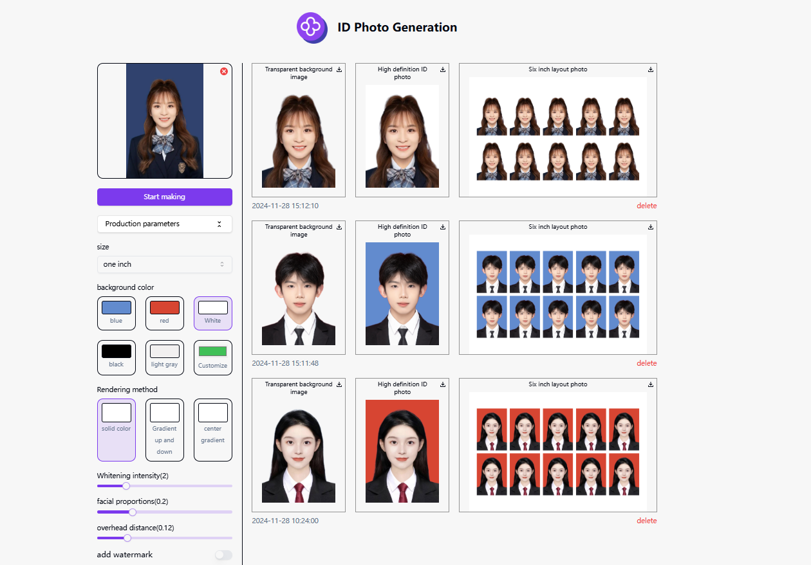

# 
📷 AI ID Photo Generator 🚀✨

[中文](README_zh.md) | [English](README.md) | [日本語](README_ja.md)

The open-source version of [AI ID Photo Generator](https://302.ai/tools/idphotos/) from [302.AI](https://302.ai).
You can directly access 302.AI for a no-code, no-configuration online version.
Alternatively, modify this project according to your needs by providing an API KEY from 302.AI and deploy it yourself.

## ✨ Introduction to 302.AI ✨
[302.AI](https://302.ai) is a pay-as-you-go AI application platform that addresses the last mile of AI implementation for practical use.
1. 🧠 Offers the latest and most complete AI capabilities, including but not limited to language models, image models, sound models, and video models.
2. 🚀 Develops deep applications on base models, creating real AI products beyond simple chatbots.
3. 💰 No monthly fees, all features are pay-as-you-go, fully open, ensuring low entry barriers and high ceilings.
4. 🛠 Powerful management backend, designed for teams and SMEs, single management, multi-user usage.
5. 🔗 All AI capabilities provide API access, all tools are open-source for custom modifications (in progress).
6. 💡 Strong development team, releasing 2-3 new applications weekly, with daily product updates. Developers interested in joining are welcome to contact us.

## Project Features
1. 🖼️ Image Generation Options
   - Size Selection: Provides various standard photo sizes such as 1-inch, 2-inch, small 1-inch, and sizes for specific certifications (e.g., teacher certification, civil service).

2. 🎨 Background Color Customization
   - Color Options: Offers predefined background colors (e.g., blue, red, white, black, light green) and allows users to define custom background colors.

3. 🌀 Rendering Style
   - Solid Color: Applies a uniform background color.
   - Vertical Gradient: Creates a top-to-bottom color gradient.
   - Center Gradient: Focuses gradient effects at the center.

4. 🔧 Image Adjustment Parameters
   - Beauty Intensity: Adjustable whitening effect via slider.
   - Face Ratio: Adjusts the ratio of face size to photo size.
   - Top Distance: Fine-tunes the distance from the top of the photo to the head.

5. 💧 Watermark Customization
Allows for setting watermark text size, opacity, angle, color, and spacing.

7. 🌙 Eye-Friendly Dark Mode: Provides a dark mode to protect your eye health.

8. 🌐 Full Internationalization: Supports interface switching between Chinese, English, and Japanese.

By generating AI ID photos, we can automatically create high-quality standard ID photos, offer personalized customization, and quickly meet diverse needs. 🎉💻 Let's explore the new world of AI-driven code together! 🌟🚀

## Tech Stack
- Next.js 14
- Tailwind CSS
- Shadcn UI

## Development & Deployment
1. Clone the project `git clone https://github.com/302ai/302_id_photo_generation`
2. Install dependencies `pnpm install`
3. Configure 302's API KEY, refer to .env.example
4. Run the project `pnpm dev`
5. Build and deploy `docker build -t coder-generator . && docker run -p 3000:3000 coder-generator`

## Interface Preview

