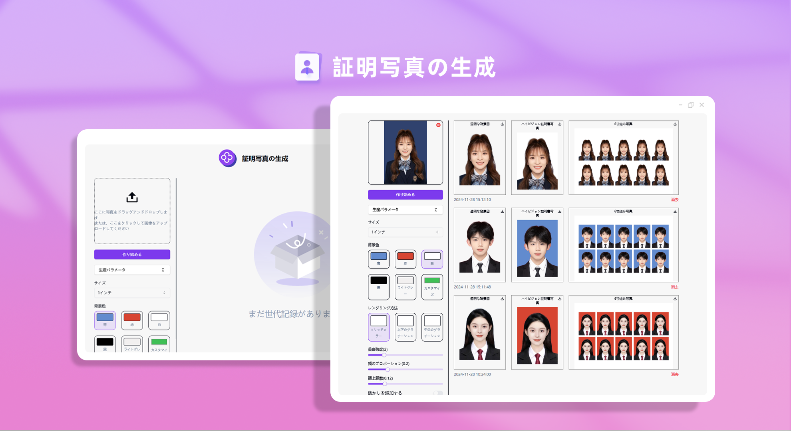
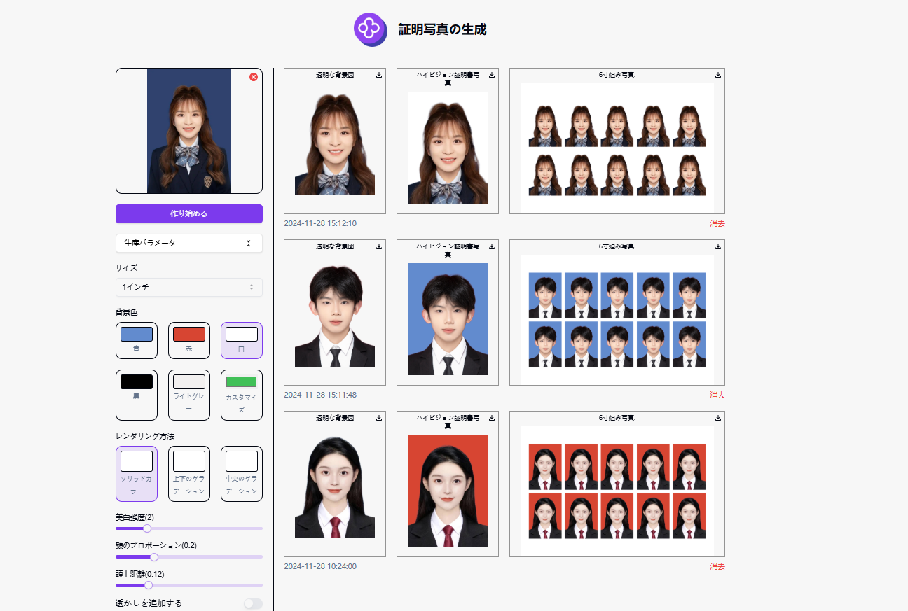

# 
📷 AI証明書写真生成 🚀✨

AI による身分証用写真の生成は、写真内の画像を迅速に切り抜き、単色、グラデーションなどの様々な背景色の身分証用写真や印刷用のレイアウト写真を生成することができます。

<a href="README_zh.md">中文</a> | <a href="README.md">English</a> | <a href="README_ja.md">日本語</a>

[302.AI](https://302.ai)からの[AI証明写真生成](https://302.ai/ja/tools/idphotos/)オープンソース版です。
直接302.AIにログインして、コード不要でオンラインバージョンを使用できます。
または、このプロジェクトを必要に応じて修正し、302.AIのAPI KEYを入力して自分でデプロイできます。

## インターフェースプレビュー
アップロードされた画像をもとに画像を切り抜き、複数の背景色の身分証用写真や印刷用のレイアウト写真を生成することができます。

## プロジェクトの特徴
### 🖼️ 画像生成オプション
   - サイズ選択: 1インチ、2インチ、小型1インチ、特定の認証用サイズ（例：教員資格証、国家公務員）など、様々な標準写真サイズを提供します。

### 🎨 背景色のカスタマイズ
   - 色オプション: ブルー、レッド、ホワイト、ブラック、ライトグリーンなどの事前定義された背景色を提供し、ユーザーが自由に背景色を定義できます。

### 🌀 レンダリングスタイル
   - 単色: 統一された背景色を適用します。
   - 上下グラデーション: 上から下へのカラーグラデーションを実現。
   - 中心グラデーション: センターにフォーカスしたグラデーション効果を実現。

### 🔧 画像調整パラメータ
   - 美白強度: スライダーで美白効果を調整可能。
   - 顔の比率: 顔のサイズと写真のサイズの比率を調整します。
   - 頭のトップ距離: 写真のトップから頭部までの距離を微調整します。

### 💧 ウォーターマークのカスタマイズ
ウォーターマークの文字サイズ、透明度、角度、色、スペースを設定できます。

### 🌙 親切なダークモード
ダークモードを提供し、目の健康を守ります。

### 🌍 多言語サポート
- 中国語インターフェース
- 英語インターフェース
- 日本語インターフェース

AI証明写真生成を通じて、高品質の標準証明写真を自動作成し、個別カスタマイズを提供して、様々なニーズに迅速に対応できます。🎉💻 AI駆動のコード新世界を一緒に探索しましょう！🌟🚀

## 🚩 将来のアップデート計画
- [ ] より多くの背景スタイルとテンプレートを更新する
- [ ] バッチ処理機能を新たに追加する

## 技術スタック
- Next.js 14
- Tailwind CSS
- Shadcn UI

## 開発とデプロイ
1. プロジェクトをクローン `git clone https://github.com/302ai/302_id_photo_generation`
2. 依存関係をインストール `pnpm install`
3. 302のAPI KEYを設定、.env.exampleを参照
4. プロジェクトを実行 `pnpm dev`
5. パッケージングとデプロイ `docker build -t coder-generator . && docker run -p 3000:3000 coder-generator`

## ✨ 302.AIの紹介 ✨
[302.AI](https://302.ai)は、AIを実践に活用する上でのラストマイルの問題を解決する、従量課金制のAIアプリケーションプラットフォームです。
1. 🧠 最新かつ最も充実したAI機能とブランドを提供し、言語モデル、画像モデル、音声モデル、動画モデルなどを含みます。
2. 🚀 基本モデルを基に深く応用開発を行い、単なるチャットボットではなく、実際のAI製品を開発します。
3. 💰 月額費用は不要で、すべての機能は従量課金制、完全に公開されており、低い参入バリアと高い上限を実現しています。
4. 🛠 強力な管理バックエンド、中小企業とチーム向け、一人で管理し、多人数で使用できます。
5. 🔗 すべてのAI機能はAPI接続を提供し、すべてのツールはオープンソースでカスタマイズ可能です（進行中）。
6. 💡 強力な開発チーム、毎週2〜3個の新しいアプリケーションをリリースし、製品は毎日更新されます。参加に興味のある開発者はお気軽にお問い合わせください。
