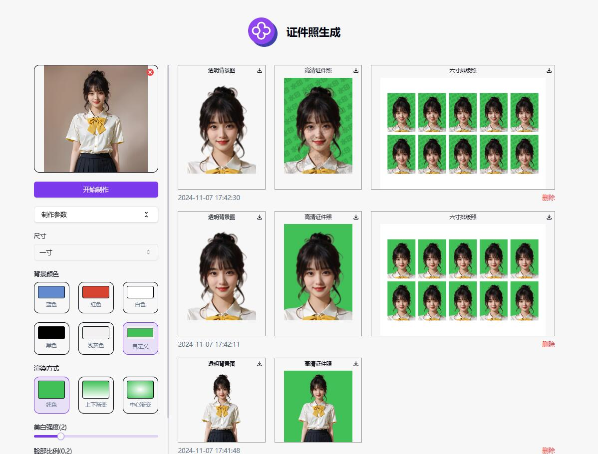

# 💻🤖 欢迎来到302.AI的 AI 证件照生成! 🚀✨

[中文](README_zh.md) | [English](README.md) | [日本語](README_ja.md)

来自[302.AI](https://302.ai)的[AI 证件照生成](https://302.ai/tools/idphotos/)的开源版本。
你可以直接登录302.AI，零代码零配置使用在线版本。
或者对本项目根据自己的需求进行修改，传入302.AI的API KEY，自行部署。

## ✨ 302.AI介绍 ✨
[302.AI](https://302.ai)是一个按需付费的AI应用平台，为用户解决AI用于实践的最后一公里问题。
1. 🧠 集合了最新最全的AI能力和品牌，包括但不限于语言模型、图像模型、声音模型、视频模型。
2. 🚀 在基础模型上进行深度应用开发，我们开发真正的AI产品，而不是简单的对话机器人
3. 💰 零月费，所有功能按需付费，全面开放，做到真正的门槛低，上限高。
4. 🛠 功能强大的管理后台，面向团队和中小企业，一人管理，多人使用。
5. 🔗 所有AI能力均提供API接入，所有工具开源可自行定制（进行中）。
6. 💡 强大的开发团队，每周推出2-3个新应用，产品每日更新。有兴趣加入的开发者也欢迎联系我们

## 项目特性
1. 🖼️ 图像生成选项
   - 尺寸选择：提供多种标准照片尺寸选项，如一寸、二寸、小一寸，以及特定认证用的尺寸（如教师资格证、国家公务员）。

2. 🎨 背景颜色定制
   - 颜色选项：提供预定义的背景颜色（如蓝色、红色、白色、黑色、浅绿色），允许用户自定义背景色。

3. 🌀 渲染方式
   - 纯色：应用统一背景颜色。
   - 上下渐变：实现由上到下的颜色渐变。
   - 中心渐变：聚焦在中心的渐变效果。

4. 🔧 图像调整参数
   - 美白强度：可通过滑块调整美白效果。
   - 脸部比例：调整面部尺寸与照片尺寸的比例。
   - 头顶部距离：微调从照片顶部到头部的距离。

5. 💧 水印定制：可以设置水印的文字大小、透明度、角度、颜色和间距。

6. 🌙 贴心暗色：提供暗色模式，呵护您的用眼健康。

7. 🌐 全面国际化：支持中文、英文、日文界面切换。

通过AI 证件照生成,我们能自动化创建高质量的标准证件照，提供个性化定制，快速满足多种需求。 🎉💻 让我们一起探索AI驱动的代码新世界吧! 🌟🚀

## 技术栈
- Next.js 14
- Tailwind CSS
- Shadcn UI

## 开发&部署
1. 克隆项目 `git clone https://github.com/302ai/302_id_photo_generation`
2. 安装依赖 `pnpm install`
3. 配置302的API KEY 参考.env.example
4. 运行项目 `pnpm dev`
5. 打包部署 `docker build -t coder-generator . && docker run -p 3000:3000 coder-generator`

## 界面预览
